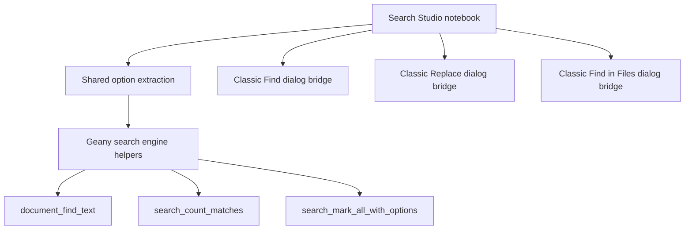

# Design: GTK Search Studio for Geany

## Objective

Continue moving Geany toward a denser, more powerful search workflow inspired by Notepad++, while preserving Geany's existing search engine and classic dialogs.

## Problem

Even after the earlier search parity improvements, Geany still exposed its search workflows through separate dialogs:
- Find
- Replace
- Find in Files
- Mark All (indirect / command driven)

Notepad++ is better for high-frequency text manipulation because it consolidates those workflows into a single search surface with more visible state.

## Design decision

Instead of replacing the classic dialogs outright, this pass introduces a **GTK Search Studio** in the main Geany tree.

### Why this is the right intermediate step
- keeps current search code paths alive and stable
- creates a higher-density front door for advanced users
- allows gradual parity improvements without a dangerous all-at-once rewrite
- provides a blueprint for the BobUI alternate frontend

## Design principles

### 1. Dual-track UX
The GTK tree now has:
- classic dialogs for compatibility
- Search Studio for denser workflow

This reduces migration risk while still moving the product forward.

### 2. Explicit search mode mapping
Search Studio uses explicit mode controls modeled after Notepad++:
- Normal
- Extended
- Regex

This is clearer than burying regex and escape semantics behind separate toggles.

### 3. Better Mark workflow
Search Studio extends Geany's old mark-all behavior by allowing:
- highlight marking
- optional bookmarking of matching lines
- purge-first bookmark control
- direct clearing of marks/bookmarks

This is an important step toward Notepad++'s richer Mark behavior.

### 4. Classic dialog interoperability
Search Studio pages can open and prefill Geany's classic dialogs.

This is strategically useful because:
- it reduces user fear during transition
- it keeps advanced legacy operations reachable
- it lets future pages become progressively more self-sufficient

## Scope of this pass

### Implemented in GTK Search Studio
- unified notebook dialog
- Find tab
- Replace tab with direct in-studio actions
- Find in Files tab with direct search launch
- Mark tab
- explicit Normal / Extended / Regex mode radios
- direct Count action
- direct Mark / Bookmark action
- direct Clear marks action
- integrated lower notebook with both activity and structured results panes
- persistent window position

### Not yet complete
- full Notepad++-level Find in Files option matrix in Search Studio (still slimmer than the classic dialog)
- complete Notepad++ Mark dialog parity (all mark filters / all purge semantics / all result routing)
- richer integrated results pane (today it is structured summaries, not yet a full clickable hit-list viewer)
- replace preview / dry-run workflow

## Data-flow architecture

## Strategic value

This pass does three things at once:
1. improves Geany immediately
2. reduces future BobUI duplication by clarifying the intended unified search model
3. creates a safe migration path from fragmented dialogs to a richer single search cockpit

## Recommended next steps

1. make the GTK Search Studio Replace page fully executable without falling back to the classic dialog
2. add a true Find in Files advanced options matrix directly in Search Studio
3. add a result / preview pane
4. add preset scopes and persistent search profiles
5. mirror the same model in the BobUI variant with shared backend logic
