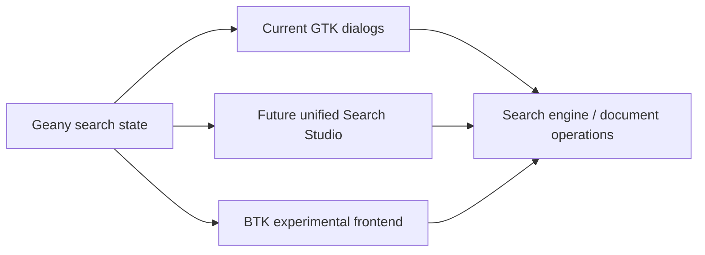

# Design: Notepad++-inspired Search Studio evolution and BTK alternate frontend

## Context

Geany's current search engine is capable, but its UI is split across separate dialogs and exposes fewer high-frequency controls directly than Notepad++.

At the same time, the project is exploring alternate UI toolkits through both:
- a staged compatibility-oriented path in the main tree
- a greenfield alternate frontend path in a separate variant directory

This document captures the design rationale for the current pass.

## Design goals

1. Increase search power-user discoverability without destabilizing existing workflows.
2. Close concrete Notepad++ parity gaps first.
3. Keep Geany's core search engine reusable from future frontends.
4. Use a separate BTK variant to explore a richer future frontend.

## Search parity architecture

### Current Geany shape
- separate Find dialog
- separate Replace dialog
- separate Find in Files dialog
- shared engine beneath them

### Target shape
A future **Search Studio** should present:
- Find
- Replace
- Find in Files
- Mark

inside a unified tabbed surface, while still reusing the same search services underneath.

### Compatibility-first step taken now
Instead of rewriting the entire search frontend in one pass, this pass lands features that are:
- easy to understand
- easy to validate
- directly useful
- reusable in a future Search Studio

These are:
- visible Wrap around control
- explicit regex dot-all control
- Count action

## Search settings model

The design now distinguishes between:

### Regex multiline behavior
Controls how matching is executed across lines / buffers.

### Dot matches newline behavior
Controls whether `.` in regex can consume newline characters.

This distinction matters because many users mentally model these as different settings, and Notepad++ exposes that difference directly.

## BTK alternate frontend design

### Why not replace the main GTK tree immediately?
Because the production Geany tree is still strongly shaped by:
- GTK3 widget assumptions
- plugin-facing UI types
- established dialog/menu wiring

A one-shot alternate toolkit migration would create too much simultaneous risk.

### Why create `variants/geany-btk`?
Because a separate variant can optimize for experimentation:
- faster iteration
- richer UI layout experiments
- zero need to preserve every historical dialog contract on day one
- clean separation between reusable logic and new frontend concepts

## Variant responsibilities

The BTK variant should focus on:
- search studio UI exploration
- transform/palette UX exploration
- high-density workflow design
- preview/result panes

The production GTK tree should focus on:
- stable functionality
- incremental parity gains
- compatibility with existing users and plugins

## Data flow

## Migration principle

The project should migrate **behavior first, surface second**:
1. normalize search-option models
2. expose missing controls
3. unify frontend shells later
4. retire old surfaces only after the new one is clearly better

## Future design extensions

### Search Studio enhancements
- result counters and previews inline
- replace-all dry run / preview mode
- document/session/project scopes in one place
- saved search presets
- command palette entry points

### BTK variant enhancements
- dockable finder pane
- preview-aware replace workflows
- transform tool integration
- keyboard-first command routing

## BTK prototype evolution

The BTK variant should now mirror the **matured Search Studio interaction model**, not just the earliest tab shell.

That means the prototype should increasingly preserve these concepts even before backend wiring exists:
- lower navigator tabs for Activity / Results / Diff Preview
- structured result rows rather than isolated per-tab placeholder text boxes
- session-aware actions like Count Session and Mark Session
- replace-preview and impact-style result routing
- explicit distinction between informational rows and navigable rows

This is strategically important because it lets the BTK frontend validate the intended workflow rhythm before the backend boundary is finalized.

The BTK prototype should now also keep pushing behavior into backend-shaped request/result models even while it still runs on prototype data. A useful near-term structure is:
- request structs for Find / Replace / Mark / Find-in-Files flows
- first-wave action specs for those families so the backend is not only string-driven
- action-result bundles carrying activity lines plus structured result rows
- result specs that explicitly track action kind, result kind, and target scope instead of only raw strings
- backend helpers that generate preview/impact/session rows independently of the widget tree

That does not yet wire the BTK variant to Geany core, but it makes the intended frontend/backend seam more explicit and keeps the UI from remaining a monolith of direct row-construction logic.
