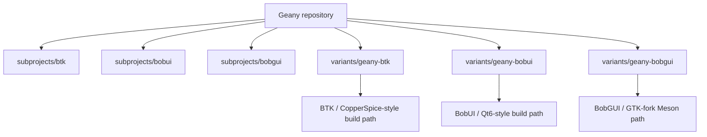

# Design: Geany multi-toolkit experimental variants (BobUI, BTK, BobGUI)

## Context

The project had already been pushing forward on a BTK-based alternate frontend, but the current request broadens the experiment again:
- add `subprojects/bobui`
- keep `subprojects/btk`
- add `subprojects/bobgui`
- make Geany able to build a separate variant for each toolkit using only that toolkit inside the respective variant folder

## Design goals

1. Keep each experimental frontend isolated by toolkit.
2. Avoid mixing toolkit references inside variant-specific source trees.
3. Preserve the stronger BTK Search Studio/backend work while reopening BobUI and BobGUI tracks.
4. Make build expectations explicit per toolkit instead of pretending all three share the same toolchain model.

## Variant layout

## Toolkit-exclusive principle

Each variant folder should use only its respective toolkit APIs:
- `variants/geany-btk/` → BTK / CopperSpice-style APIs
- `variants/geany-bobui/` → BobUI / Qt6-style APIs
- `variants/geany-bobgui/` → BobGUI / GObject-style APIs

That does not forbid conceptual reuse across variants, but it does forbid a BobUI folder that depends on BTK widgets or a BobGUI folder that embeds Qt-style UI code.

## Build-system principle

The variants do not need to force one universal build system today.

Instead:
- BTK variant keeps its working CMake + runtime-staging path
- BobUI variant uses a Qt6-compatible CMake discovery path aimed at BobUI package trees, with Windows launcher generation when a runtime directory can be derived from `Qt6_DIR`
- BobGUI variant uses Meson with `dependency('bobgui4')`, which matches the BobGUI ecosystem more naturally, plus a small helper script for Meson-capable environments

## Practical migration stance

BTK remains the most validated alternate frontend path in this environment.
BobUI and BobGUI are now restored as parallel experimental tracks rather than being treated as the one definitive future path.

This is a pragmatic design because it lets the repo:
- validate multiple toolkit-exclusive shells
- keep current BTK backend/search work moving
- give BobUI and BobGUI clearer build/run entry points instead of leaving them as only raw source trees
- avoid overclaiming build parity when local toolchains differ sharply
